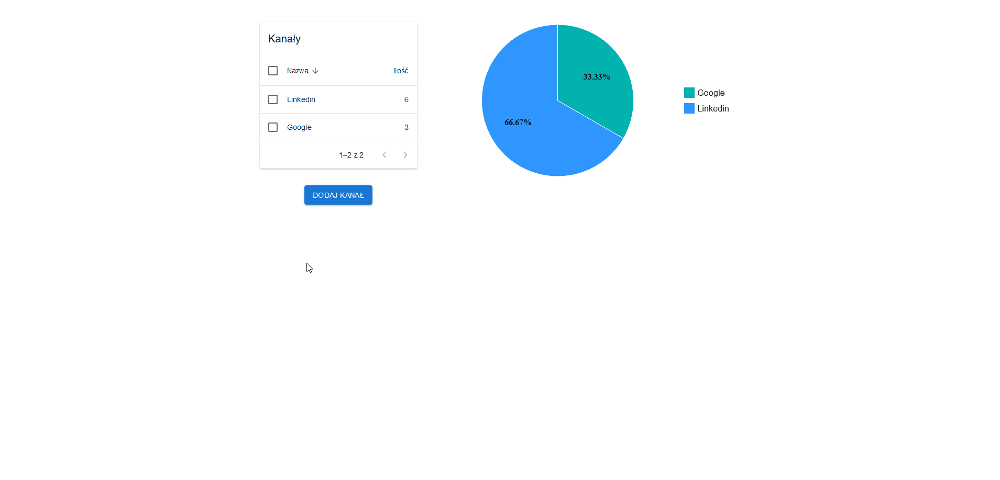
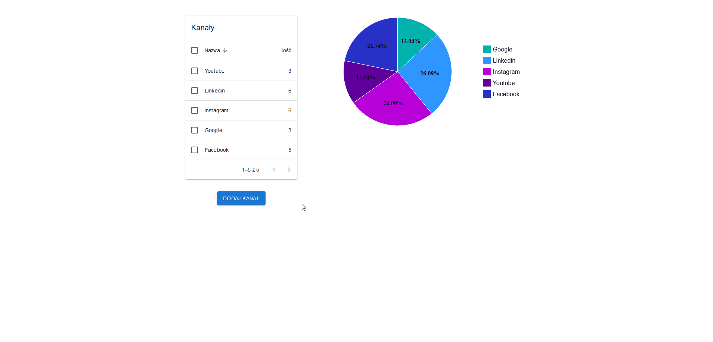

# Zadanie

## Spis

-   [Aplikacja](#aplikacja)
-   [Frontend](#frontend)
-   [Backend](#backend)

## Aplikacja

Aplikacja jest responsywna i działa na telefonach i komputerach. Wygląd strony wraz z wykresem jest dynamicznie zmieniany zależnie od danych.

Dane w aplikacji można sortować klikając w tabelę. Jest możliwość zaznaczenia wielu kanałów do usunięcia (za pomocą checkboxów). Edytowanie danych kanału odbywa się w modalu, który wyświetla się po kliknięciu w wiersz tabeli. Dane mogą być sortowane rozsnąco i malejąco, po nazwie kanału lub po ilości klientów z kanału.

## Frontend

Frontend został stworzony za pomocą Reacta + Typescripta. Do stworzenia projektu użyłem Vite. Za wygląd aplikacji odpowiadają gotowe komponenty z Material UI ze stylami tworzonymi podobnie do tych w React Native.

Frontend posiada 4 testy napisane z wykorzystaniem vitest, testujące widoczność danych oraz łączenia z API.

Po zainstalowaniu niezbędnych bibliotek, frontend można uruchomić za pomocą komendy `npm run dev`. Testy można uruchomić za pomocą komendy `npx vitest`.

## Backend

Backend został stworzony w PHP (Laravel), a dane są zapisywane w MySQL.

Backend posiada łącznie 12 testów, testujących działanie API.

Po zainstalowaniu niezbędnych bibliotek, backend można uruchomić za pomocą komendy `php artisan serve`. Testy można uruchomić za pomocą komendy `php artisan test`.
